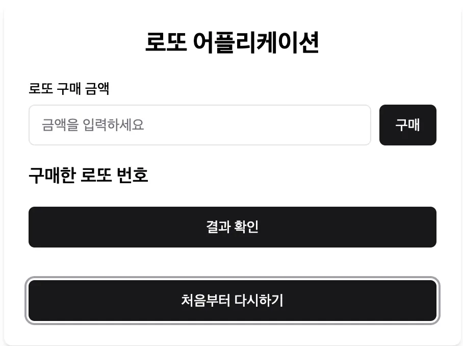
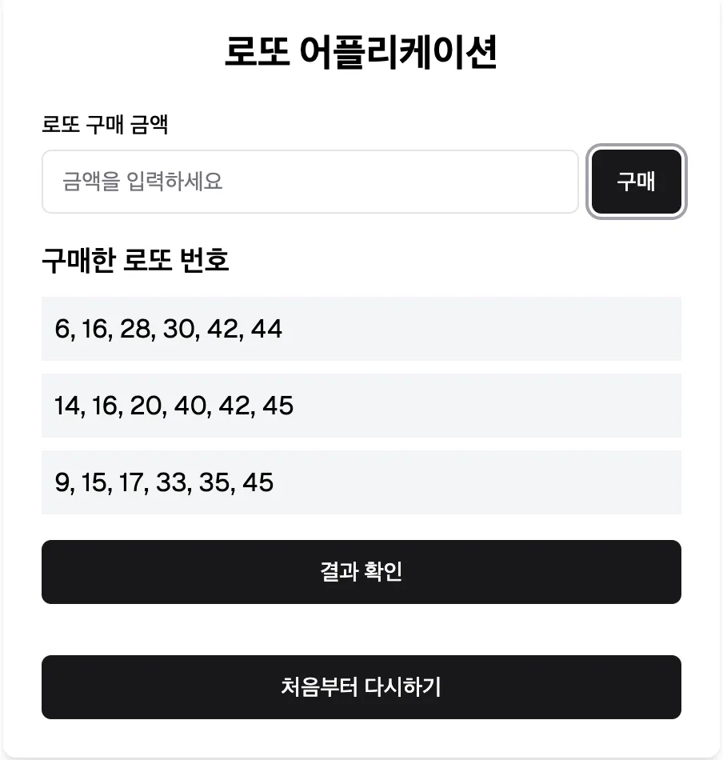
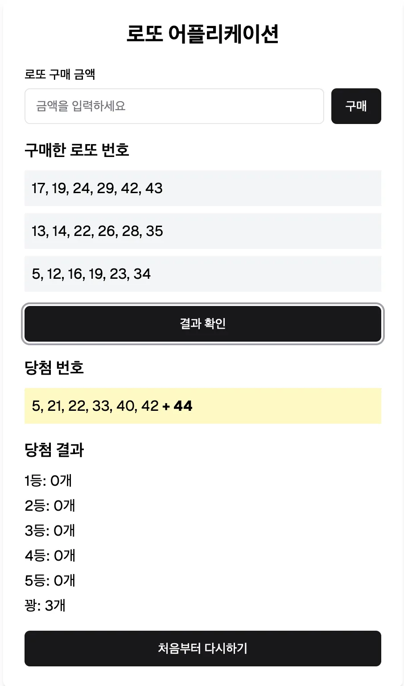

# 1주차 과제

## 로또 어플리케이션 만들기

### 과제 소개

- **웹을 기반**으로 로또 어플리케이션을 만들 예정이에요.
- 기술 스택은 **React + TypeScript(JavaScript)**로 진행해요. 필요에 따라서 라이브러리를 설치해서 사용해도 괜찮아요.
- 디자인에 대해서는 크게 중요하지 않으니 본인의 재량에 따라 구현해주시면 돼요.
- **요구사항에 부족한 부분이 있다면 합리적인 판단하에 가정을 하고 개발을 해주세요.**
- https://tfin3bzqewgmvgra.vercel.app/에서 데모를 확인해보실 수 있어요.

### 디자인

#### 기본

#### 구매

#### 결과 확인

### 기본 요구사항

#### 1.1. 로또 구매하기

- 사용자가 **로또를 여러 장 구매**할 수 있도록 구현합니다.
- 로또는 **1장에 1,000원**이며 사용자가 1,000원으로 나누어 떨어지는 값을 입력하지 않은 경우에는 적절한 에러메시지를 보여줍니다.
- 사용자가 **로또를 구매할 금액을 입력하고 구매 버튼**을 클릭하면, **해당 금액에 해당하는 개수만큼** 로또 번호를 랜덤하게 생성하여 사용자에게 제공합니다.
- 로또 번호는 **1부터 45까지의 숫자 중 6개를 랜덤하게 생성**합니다.
- 번호는 **중복되지 않아야 하며, 오름차순으로 정렬**합니다.

#### 1.2. 당첨 번호와 비교

- **결과 확인 버튼을 클릭하면** 생성된 로또 번호와 사용자가 입력한 번호를 비교하여 당첨 결과를 보여줍니다.
- **매칭된 숫자의 개수에 따라 당첨 결과를 출력**합니다:
  - 6개 일치: 1등
  - 5개 일치 + 보너스 번호 일치: 2등
  - 5개 일치: 3등
  - 4개 일치: 4등
  - 3개 일치: 5등
  - 그 외: 꽝

#### 1.3. 보너스 번호

- 당첨 번호 생성 시, **6개 번호 외에 1개의 보너스 번호**를 추가로 생성합니다.
- 5개 번호가 일치하고 보너스 번호가 일치하면 **2등**으로 간주합니다.

#### 1.4 초기화

- **처음부터 다시하기** 버튼을 클릭하면 로또 어플리케이션의 처음 상태로 돌아갑니다.
- 모든 데이터가 초기화되어야 합니다.

### 선택 요구사항

#### 2.1. 과거 당첨 기록 저장

- 사용자의 로또 번호와 결과를 저장하여, **이전에 구매한 번호와 당첨 여부를 별도로 확인**할 수 있습니다.

#### 2.2. 통계 기능

- **자주 등장하는 번호**와 같은 간단한 통계를 제공합니다.
